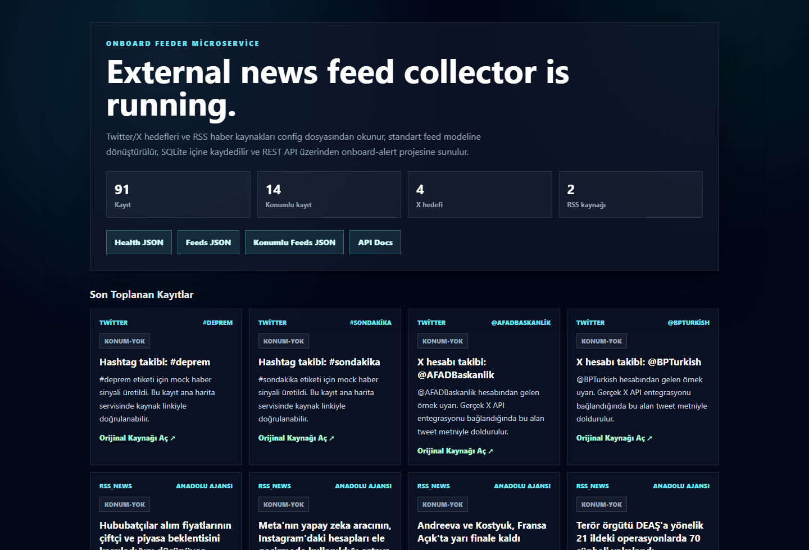
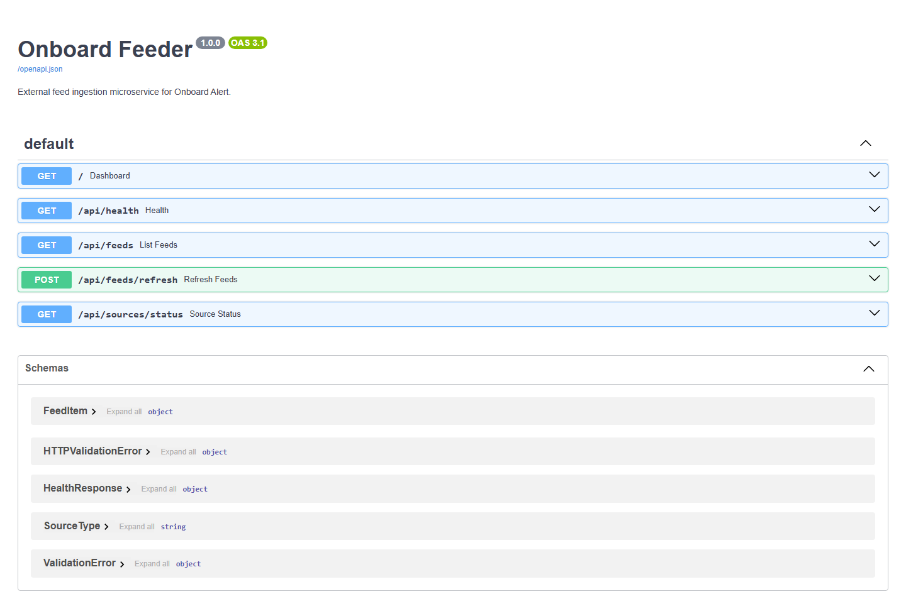
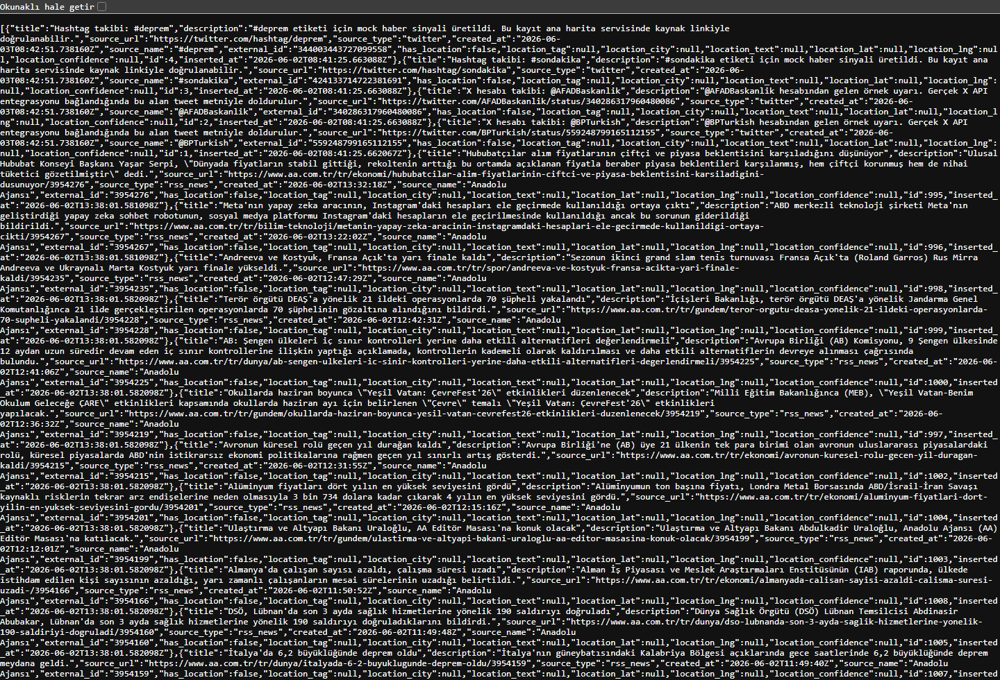
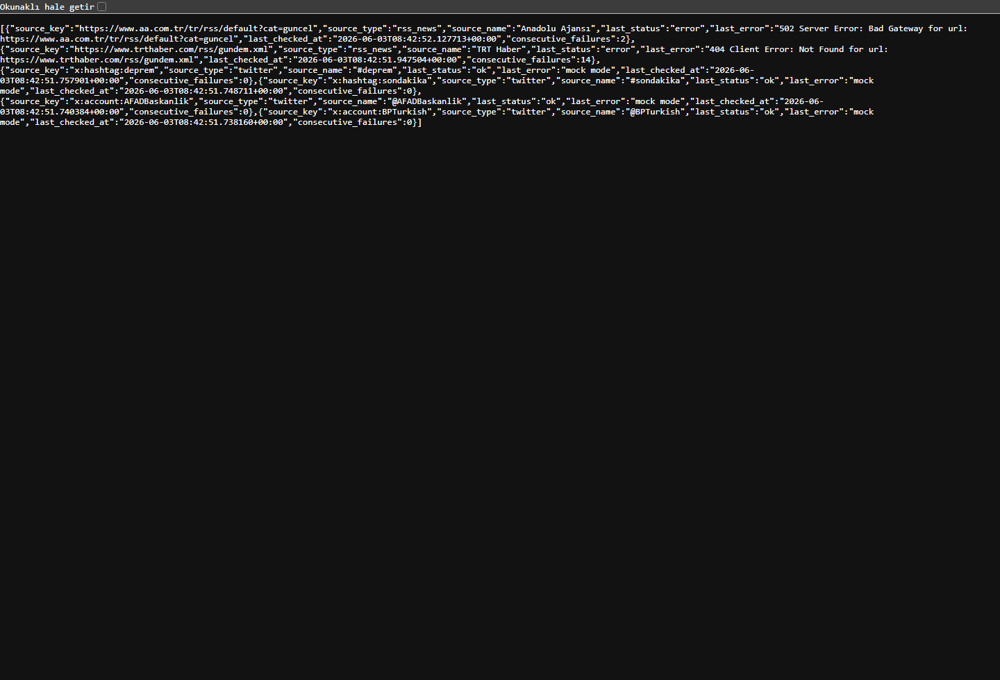
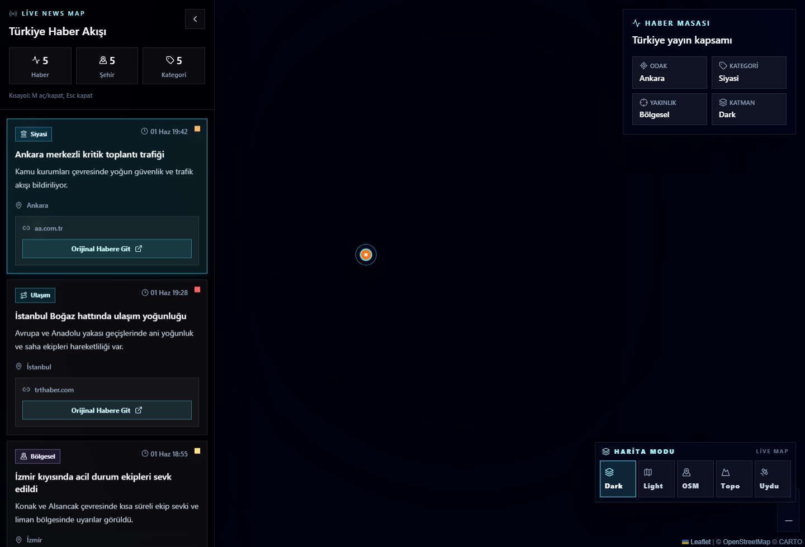

# Onboard Feeder

<p align="center">
  <strong>FastAPI-based external feed collector for the Onboard Alert live news and crisis map.</strong>
</p>

<p align="center">
  
  
  
  
  
</p>

---

## Overview

Onboard Feeder is a lightweight Python microservice that collects external news signals and exposes them as a clean REST API for the `onboard-alert` map platform.

It reads RSS targets, Twitter/X account placeholders, and hashtag targets from a dynamic `config.json` file, normalizes incoming items into a shared schema, enriches them with location tags when Turkish city names are detected, stores them in SQLite, and serves the latest feed items through FastAPI.

The service is designed as an ingestion layer, not a full article mirror. It keeps short snippets and original source URLs so downstream applications can redirect users to the publisher or embed the original source safely.

---

## Screenshots

### Service Dashboard



### FastAPI Documentation



### Feed JSON Output



### Source Health Monitoring



### Integrated Alert Map



---

## Features

- Dynamic target configuration through `config.json`
- RSS ingestion with `requests`, `feedparser`, and `BeautifulSoup`
- Twitter/X scraper skeleton with mock account and hashtag signals
- Pydantic-based feed schema validation
- SQLite storage with unique `source_url` deduplication
- SQLite WAL mode and busy timeout for safer concurrent reads/writes
- Background polling with APScheduler
- Location extraction for Turkish city names
- `location_only=true` feed filtering
- Source health tracking for RSS and mock Twitter/X targets
- Protected manual refresh endpoint via `x-api-key`
- HMAC-signed webhook push into `onboard-alert`
- Manual integration push endpoint for operational control
- CORS support for the Onboard Alert frontend
- FastAPI Swagger documentation

---

## Architecture

```text
config.json
   |
   v
config.py
   |
   v
scrapers/
   |-- news_scraper.py       RSS/news ingestion
   |-- twitter_scraper.py    Twitter/X mock ingestion skeleton
   |
   v
services/
   |-- collector.py          Runs all scrapers and persists results
   |-- location_extractor.py Detects Turkish city mentions
   |
   v
storage/
   |-- repository.py         SQLite persistence and source health state
   |
   v
services/alert_client.py     Signed webhook delivery into onboard-alert
   |
   v
main.py                     FastAPI app, dashboard, REST endpoints
```

---

## Project Structure

```text
onboard-feeder/
  config.json
  config.py
  main.py
  models.py
  requirements.txt
  scrapers/
    news_scraper.py
    twitter_scraper.py
  services/
    collector.py
    location_extractor.py
  storage/
    repository.py
  docs/
    screenshots/
      dashboard.png
      api-docs.png
      feeds-json.png
      source-status.png
```

---

## Configuration

All feed targets are configured in `config.json`.

```json
{
  "app": {
    "admin_api_key": "change-this-feeder-admin-key",
    "cors_origins": [
      "http://127.0.0.1:5173",
      "http://localhost:5173"
    ],
    "database_path": "storage/feeds.db",
    "poll_interval_minutes": 15,
    "request_timeout_seconds": 12,
    "user_agent": "onboard-feeder/1.0"
  },
  "alert_integration": {
    "enabled": true,
    "api_url": "http://127.0.0.1:4000",
    "bot_ingest_api_key": "change-this-bot-key",
    "bot_ingest_hmac_secret": "change-this-long-hmac-secret-please",
    "push_after_collect": false,
    "min_confidence": 0.55
  },
  "twitter": {
    "enabled": true,
    "mock_mode": true,
    "accounts": ["BPTurkish", "AFADBaskanlik"],
    "hashtags": ["sondakika", "deprem"]
  },
  "rss_news": {
    "enabled": true,
    "feeds": [
      {
        "name": "Example News",
        "url": "https://example.com/rss.xml"
      }
    ]
  }
}
```

> Change `admin_api_key` before using this service outside local development.

---

## API Endpoints

| Method | Endpoint | Description |
| --- | --- | --- |
| `GET` | `/` | HTML dashboard |
| `GET` | `/api/health` | Service health and item counts |
| `GET` | `/api/feeds?limit=50&offset=0` | Latest collected feed items |
| `GET` | `/api/feeds?location_only=true` | Feed items with detected locations |
| `GET` | `/api/sources/status` | Per-source health state |
| `POST` | `/api/feeds/refresh` | Manually trigger collection, protected by `x-api-key` |
| `POST` | `/api/integrations/onboard-alert/push` | Push collected items into Onboard Alert |
| `GET` | `/docs` | FastAPI Swagger documentation |

Manual refresh example:

```bash
curl -X POST "http://127.0.0.1:8001/api/feeds/refresh" \
  -H "x-api-key: change-this-feeder-admin-key"
```

Push latest feeder items into Onboard Alert:

```bash
curl -X POST "http://127.0.0.1:8001/api/integrations/onboard-alert/push?limit=50" \
  -H "x-api-key: change-this-feeder-admin-key"
```

---

## Bi-Directional Integration With Onboard Alert

The integration uses a REST webhook flow:

```text
External RSS/X targets
  -> onboard-feeder collectors
  -> normalized FeedItem records
  -> HMAC-signed POST /api/webhooks/bot-ingest
  -> onboard-alert backend triage/publish workflow
  -> React/Leaflet live map
```

`onboard-feeder` keeps source health, raw feed state, and source URLs. `onboard-alert` owns editorial state: `published`, `pending_review`, and `pending_location`.

Webhook requests include:

- `x-api-key`
- `x-timestamp`
- `x-signature`

The signature is generated with `HMAC-SHA256(timestamp + "." + JSON payload)`.

Onboard Alert deduplicates bot-ingested records by `sourceUrl`, so repeated feeder pushes do not create duplicate map alerts.

---

## Feed Schema

Each collected item is normalized into this shape:

```json
{
  "id": 1,
  "title": "Example title",
  "description": "Short snippet only",
  "source_url": "https://publisher.example/news/1",
  "source_type": "rss_news",
  "created_at": "2026-06-03T08:00:00Z",
  "source_name": "Example News",
  "external_id": "publisher-entry-id",
  "has_location": true,
  "location_tag": "konum:İstanbul",
  "location_city": "İstanbul",
  "location_lat": 41.0082,
  "location_lng": 28.9784,
  "location_confidence": 0.92,
  "inserted_at": "2026-06-03T08:01:00Z"
}
```

---

## Local Development

Create and activate a virtual environment:

```bash
python -m venv .venv
```

Windows:

```powershell
.\.venv\Scripts\activate
```

macOS/Linux:

```bash
source .venv/bin/activate
```

Install dependencies:

```bash
pip install -r requirements.txt
```

Run the service:

```bash
uvicorn main:app --host 127.0.0.1 --port 8001 --reload
```

Open:

```text
http://127.0.0.1:8001/
http://127.0.0.1:8001/docs
```

Run the integrated local stack from this repository, assuming `onboard-alert` is a sibling directory:

```powershell
.\scripts\start-integrated.ps1
```

This starts:

```text
onboard-feeder       http://127.0.0.1:8001
onboard-alert API    http://127.0.0.1:4000
onboard-alert UI     http://127.0.0.1:5173
```

---

## Production Notes

This service is intentionally compact, but several operational rules matter:

- Do not expose `/api/feeds/refresh` without a strong API key or gateway policy.
- Replace mock Twitter/X scraping with an official API, approved provider, or compliant data source.
- Monitor `/api/sources/status` for `error` states and repeated failures.
- Rotate user agents and polling intervals responsibly.
- Move from SQLite to PostgreSQL if ingestion volume grows significantly.
- Keep only snippets and source URLs to reduce copyright and storage risk.
- Add centralized logs and metrics before running unattended in production.

---

## Roadmap

- PostgreSQL storage adapter
- Queue-based scraper workers
- Per-source backoff policy
- Real Twitter/X provider integration
- Webhook delivery into `onboard-alert`
- Admin UI for editing `config.json`
- Better NLP-based event location extraction

---

## License

This project is prepared as part of the Onboard Alert ecosystem. Add a license file before public production distribution.
